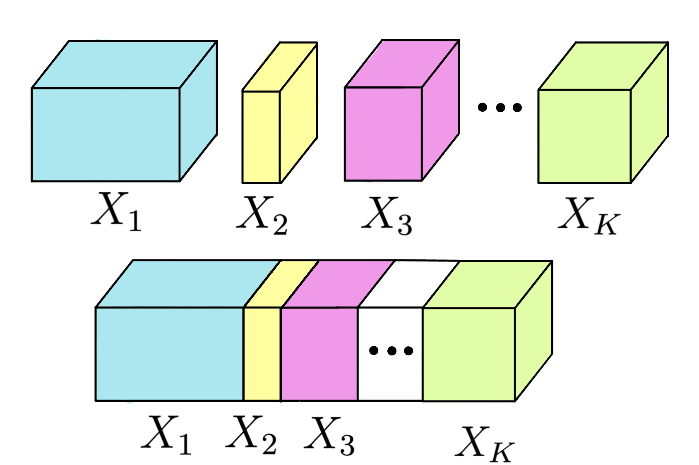

# TBI — Tensor Block Interpreter

Multilinear PCA for block tensors. TBI extends Multiple Co-Inertia Analysis (MCIA) into the $\star_\mathbf{M}$ tensor algebra of [Kilmer et al. (2021)](https://www.pnas.org/doi/10.1073/pnas.2015851118), so it can compress and interpret data that is simultaneously *multi-block* (e.g. multi-omics — different assays per sample) and *multilinear* (e.g. longitudinal — different timepoints per sample).

<p align="center">
  
</p>
<p align="center">
  <em>A block tensor: m subjects × p variables × n timepoints, with the variable axis partitioned into K blocks (e.g. one block per omics assay).</em>
</p>

## What TBI does

Multi-omics, longitudinal, and similar datasets have two structural features that classical PCA ignores:

1. **Block structure.** Subjects are measured by several heterogeneous assays at different scales and dimensionalities. A flat PCA over-weights the assay with the most variables.
2. **Multilinear structure.** Repeated measurements over time live on a third tensor mode. Matricizing them throws away that structure.

TBI handles both. It transforms the third mode (a DCT by default; any orthogonal matrix works), normalizes each block to equal Frobenius energy, and then optimizes the MCIA covariance criterion sheet by sheet under the $\star_\mathbf{M}$ product. Two variants are provided:

- **TBI-I** — iterative deflation. Each iteration extracts one component *from every sheet*. Robust and predictable.
- **TBI-II** — greedy deflation. Each iteration picks the *single most informative sheet* and extracts one component from it. More storage-efficient when signal is concentrated in a few timepoints.

For comparisons, the package also ships matrix MCIA (the tensor-blind baseline) and block-tPLS ([Kodikara et al. 2026](https://doi.org/10.1101/2026.02.10.705179), the tensor competitor).

## Install

```bash
pip install -e .            # core (numpy only)
pip install -e ".[dev]"     # +pytest, matplotlib, pandas, scikit-learn for tests / benchmarks
```

Python ≥ 3.9.

## Quickstart

```python
import numpy as np
from TBI import TBI_II, load_dataset
from TBI.analysis_utils import dct_matrix

# Load a benchmark dataset: returns (X, b, metadata)
#   X : (m subjects, p variables, n timepoints)
#   b : 1D array of block start indices along the variable axis
X, b, meta = load_dataset("cmipb")           # 62 × 441 × 4, 4 omics blocks
m, p, n = X.shape

# Build a mode-3 transform (DCT is a strong default; identity also works)
M = dct_matrix(n)

# Greedy TBI: extract components until 95% energy is recovered
result = TBI_II(X, b, M, energy=0.95, max_iter=15)

print(result.scores.shape)              # (m, n_iter) global scores
print(result.block_loadings[0].shape)   # (p_0, n_iter) loadings for block 0
print(result.sheet_indices)             # which sheet each component came from
```

To use your own data, pass an `(m, p, n)` numpy array `X` and a `b` array of block-start indices. `b[0]` must be 0; block $k$ spans columns `b[k]:b[k+1]`.

## What's in this repo

```
src/TBI/
├── TBI_I.py / TBI_II.py        — the two TBI variants
├── matrix_MCIA.py              — classical matrix MCIA baseline
├── baselines/block_tpls.py     — block-tPLS competitor (Kodikara et al. 2026)
├── star_M.py                   — mode-3 product, starM, Mtran, Msvd
├── normalization.py            — variable / block / MCIA tensor normalization
├── helpers.py, metrics.py      — shared utilities and scoring
├── analysis_utils.py           — DCT, scree plots, scatter, storage helpers
├── result_types.py             — uniform BenchmarkResult adapters
└── data/                       — dataset registry + loaders (cmipb, suez2018)
benchmarks/                     — compression and clustering benchmarks
demos/                          — worked examples
tests/                          — pytest suite (275 tests)
```

## Datasets

Two datasets are registered out of the box. Both are fetched on first call and cached under `data/` (gitignored).

| Name | Shape | Description | Citation |
|---|---|---|---|
| `cmipb` | 62 × 441 × 4 | CMI-PB pertussis-vaccine response — 4 omics blocks (antibody titer, cell frequency, cytokine Olink, cytokine LegendPlex) at 4 timepoints. Multi-block + longitudinal. | Fourati et al. (2025) *PLoS Comp Biol* 21(3):e1012927 |
| `suez2018` | 17 × 482 × 9 | Post-antibiotic gut microbiome (16S rRNA), taxa grouped by phylum, 9 timepoints. Single-omic but block-partitioned by phylum. | Suez et al. (2018) *Cell* 174(6):1406–1423 |

```python
from TBI import list_datasets
for name, spec in list_datasets().items():
    print(f"{name}: {spec.description}")
```

To register your own dataset, see `TBI.data.register_dataset` in `src/TBI/data/registry.py`.

## Benchmarks

Two reproducible benchmarks live under `benchmarks/`:

- **`compression_benchmark.py`** — Relative Frobenius reconstruction error vs. compression ratio. Sweeps components 1 … 15 for each method. Tests Theorem 5.3 of Kilmer et al. (2021).
- **`clustering_benchmark.py`** — ARI of $k$-means on recovered scores against a planted block-temporal partition. Run on a controlled simulation across SNR ∈ {0.5, 2, 5, 10}, 10 seeds per level.

Run them:

```bash
python benchmarks/compression_benchmark.py
python benchmarks/clustering_benchmark.py
```

Output PNGs are written to `figures/benchmarks/` (gitignored). Both benchmarks report TBI-I, TBI-II, matrix MCIA, and block-tPLS together.

## Method comparison at a glance

| Method | Tensor-aware? | Block-aware? | Per-component storage |
|---|---|---|---|
| Matrix MCIA | ✗ (unfolds to $m \times pn$) | ✓ | $m + pn$ |
| t-SVDM (Kilmer et al. 2021) | ✓ | ✗ | $(m+p)\,n$ |
| tensorOmics / block-tPLS (Kodikara et al. 2026) | ✓ | ✓ (regression-mode PLS) | $m + p$ |
| **TBI-I** (this work) | ✓ | ✓ | $(m+p)\,n$ |
| **TBI-II** (this work) | ✓ | ✓ | $m + p$ |

TBI is the consensus-MCIA-style symmetric counterpart to block-tPLS: same blocks-and-tensor scope, but optimizes the MCIA covariance criterion rather than a regression objective.

## Citation

A paper accompanies this code. Until it appears, please cite as:

```bibtex
@misc{grossmann2026tbi,
  title  = {Tensor Block Interpreter (TBI): A Multidimensional approach to Block-MCIA},
  author = {Grossmann, Luca and Kilmer, Misha and Konstorum, Anna},
  year   = {2026},
  note   = {Manuscript in preparation}
}
```

## License

[MIT](LICENSE).
